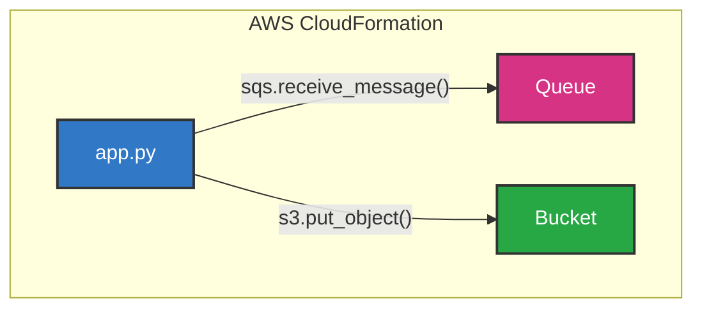

# CloudFormation の使い方

以下のようなアーキテクチャで作成してみる。



## スタックの確認

```sh
$ aws cloudformation describe-stacks
# 無ければ以下のようになる
{
    "Stacks": []
}
```

## テンプレートを作成

template.yaml を作成

```chapter04/template.yaml
AWSTemplateFormatVersion: '2010-09-09'

Resources:
  Queue:
    Type: AWS::SQS::Queue
    Properties:
      QueueName: chapter04-queue
      ReceiveMessageWaitTimeSeconds: 20
  Bucket:
    Type: AWS::S3::Bucket
    Properties:
      BucketName: chapter04-bucket
```

## デプロイ実行

```shell
$ aws cloudformation deploy \
    --stack-name chapter04-stack \
    --template-file template.yaml

Waiting for changeset to be created..
Waiting for stack create/update to complete
Successfully created/updated stack - chapter04-stack
```

### リソース確認

```sh
$ aws sqs list-queues
$ aws s3 ls
$ aws cloudformation describe-stacks
```

## スタックの削除

**重要**: リソースの削除はコスト管理の観点から必須の操作です。

```shell
$ aws cloudformation delete-stack --stack-name chapter04-stack

# 削除の進行状況を確認
$ aws cloudformation describe-stacks --stack-name chapter04-stack
```

削除が完了すると、スタックが見つからないエラーが返されます：

```
An error occurred (ValidationError) when calling the DescribeStacks operation: Stack with id chapter04-stack does not exist
```

## 次に学ぶべき CloudFormation の機能

### 1. **スタックの更新**

- テンプレートを変更してリソースを追加・変更
- `aws cloudformation deploy` で差分更新

```chapter04/template-updated.yaml
AWSTemplateFormatVersion: '2010-09-09'

Resources:
  Queue:
    Type: AWS::SQS::Queue
    Properties:
      QueueName: chapter04-queue
      ReceiveMessageWaitTimeSeconds: 10  # 20秒から10秒に変更
      VisibilityTimeoutSeconds: 30       # 新しい設定を追加
  Bucket:
    Type: AWS::S3::Bucket
    Properties:
      BucketName: chapter04-bucket
      VersioningConfiguration:           # バージョニングを有効化
        Status: Enabled
  # 新しいリソース: DynamoDBテーブル
  UserTable:
    Type: AWS::DynamoDB::Table
    Properties:
      TableName: chapter04-users
      AttributeDefinitions:
        - AttributeName: userId
          AttributeType: S
      KeySchema:
        - AttributeName: userId
          KeyType: HASH
      BillingMode: PAY_PER_REQUEST

```

実行

```sh
$ aws cloudformation deploy \
    --stack-name chapter04-stack \
    --template-file template-updated.yaml

```

もちろん、もう一度最初の template.yaml を deploy すると、DynamoDB は消える。

```sh
$ aws cloudformation deploy \
    --stack-name chapter04-stack \
    --template-file template.yaml

$ echo "=== デプロイ後のDynamoDBテーブル ===" && aws dynamodb list-tables
```

### 2. **パラメータの活用**

テンプレートを再利用可能にし、デプロイ時に値を指定できる機能です。同じテンプレートで開発・テスト・本番環境を作成可能。

```yaml
Parameters:
  Environment:
    Type: String
    Default: dev
    AllowedValues: [dev, test, prod]
  BucketName:
    Type: String
    Default: my-default-bucket

Resources:
  Bucket:
    Properties:
      BucketName: !Sub '${Environment}-${BucketName}' # dev-my-default-bucket
```

```sh
# デフォルト値でデプロイ
aws cloudformation deploy --stack-name dev-stack --template-file template.yaml

# パラメータを指定してデプロイ
aws cloudformation deploy \
  --stack-name prod-stack \
  --template-file template.yaml \
  --parameter-overrides Environment=prod BucketName=production-bucket
```

### 3. **出力の定義**

```yaml
Outputs:
  QueueURL:
    Description: 'SQS Queue URL'
    Value: !Ref Queue
```

### 4. **条件分岐**

- 環境によってリソースを変える
- `Conditions` セクションの使用

### 5. **依存関係の管理**

- `DependsOn` 属性
- 暗黙的な依存関係の理解

### 6. **エラーハンドリング**

- ロールバック機能
- スタック作成失敗時の対処

## 余談 json で結果を出力

```sh
$ aws cloudformation describe-stacks > stacks.json
$ aws cloudformation describe-stacks --stack-name chapter04-stack > chapter04-stack.json
$ aws cloudformation describe-stacks --output json > stacks.json
# jqコマンドで見やすくする。
$ aws cloudformation describe-stacks | jq '.' > formatted-stacks.json
```
