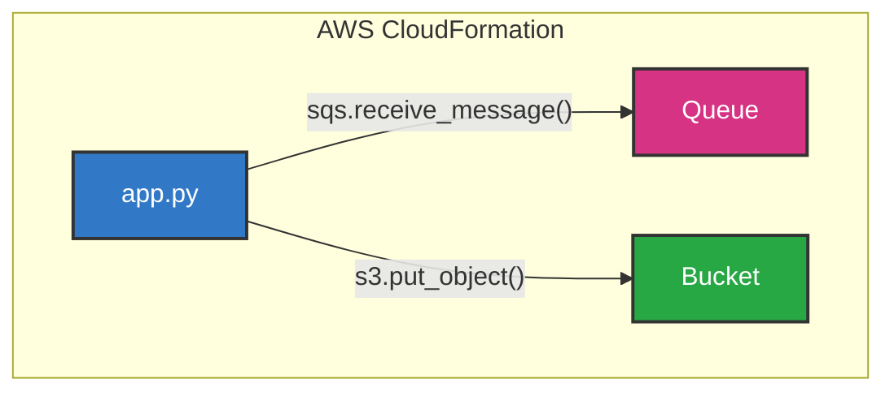

## Chapter 04 AWS CloudFormation でデプロイを自動化しよう

アーキテクチャ



### AWS CloudFormaiton スタックをデプロイする

```shell
$ cd ${CODESPACE_VSCODE_FOLDER}/chapter04
# AWS CloudFormation スタックが存在しないことを確認
$ aws cloudformation describe-stacks
{
    "Stacks": []
}
```

template.yaml を作成

```chapter04/template.yaml
AWSTemplateFormatVersion: '2010-09-09'

Resources:
  Queue:
    Type: AWS::SQS::Queue
    Properties:
      QueueName: chapter04-queue
      ReceiveMessageWaitTimeSeconds: 20
  Bucket:
    Type: AWS::S3::Bucket
    Properties:
      BucketName: chapter04-bucket
```

デプロイ実行

```shell
$ aws cloudformation deploy \
    --stack-name chapter04-stack \
    --template-file template.yaml

Waiting for changeset to be created..
Waiting for stack create/update to complete
Successfully created/updated stack - chapter04-stack
```

### リソース確認

```shell
$ aws sqs list-queues
{
    "QueueUrls": [
      ...
        "http://sqs.us-east-1.localhost.localstack.cloud:4566/000000000000/chapter04-queue"
    ]
}
$ aws s3 ls
2025-06-01 17:53:44 chapter03-bucket
2025-06-01 20:54:56 chapter04-bucket
```

Amazon SQS キューと Amazon S3 バケットがデプロイされていることがわかる。
