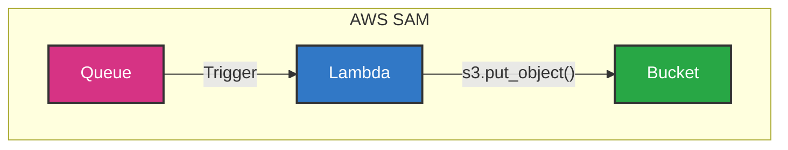

## Chapter 05 AWS SAM でサーバレスアプリケーションをデプロイしよう



### SAM

SAM CLI はすでにインストールされているので、そのまま使う。

作業ディレクトリを作成し、workshop の git リポジトリから、template.yaml と samconfig.yoml をコピーする。
また、src/app.py もコピーする。

us-east-1 で作業していたので、ap-northeast-1 から us-east-1 に変更しておく。
ビルドとデプロイを実行する。

```shell
$ cd ${CODESPACE_VSCODE_FOLDER}/chapter05
$ sam build
$ sam deploy

```

#### クリーンアップ

間違ったリージョン ap-northeast-1 にデプロイしてしまったので、削除する。

```shell
# 確認
$ aws cloudformation list-stacks --region ap-northeast-1
{
    "StackSummaries": [
        {
            "StackId": "arn:aws:cloudformation:ap-northeast-1:000000000000:stack/aws-sam-cli-managed-default/8afb7004",
            "StackName": "aws-sam-cli-managed-default",
            "CreationTime": "2025-06-01T12:19:31.018000+00:00",
            "LastUpdatedTime": "2025-06-01T12:19:31.018000+00:00",
            "StackStatus": "CREATE_COMPLETE",
            "DriftInformation": {
                "StackDriftStatus": "NOT_CHECKED"
            }
        },
        {
            "StackId": "arn:aws:cloudformation:ap-northeast-1:000000000000:stack/chapter05-stack/4d57b66a",
            "StackName": "chapter05-stack",
            "CreationTime": "2025-06-01T12:19:46.727000+00:00",
            "LastUpdatedTime": "2025-06-01T12:19:46.727000+00:00",
            "StackStatus": "CREATE_COMPLETE",
            "DriftInformation": {
                "StackDriftStatus": "NOT_CHECKED"
            }
        }
    ]
}
# SAMでスタックを削除
$ sam delete --region ap-northeast-1
# SAMが自動作成した管理用スタック aws-sam-cli-managed-default も削除
$ aws cloudformation delete-stack --stack-name aws-sam-cli-managed-default --region ap-northeast-1

$ aws cloudformation list-stacks --region ap-northeast-1 --stack-status-filter CREATE_COMPLETE UPDATE_COMPLETE

{
    "StackSummaries": []
}
```

AWS CloudFormation での動作
DELETE_COMPLETE 状態のものは

- 90 日間保持: 削除されたスタックの履歴は約 90 日間保持されます
- 自動削除: 90 日後に自動的にリストから消えます
- フィルタリング可能: list-stacks で特定の状態のみを表示できます

あらためて、config を修正し、us-east-1 でデプロイを行う。

```shell
$ sam build
$ sam deploy
```

### 確認

```shell
$ aws sqs list-queues
{
    "QueueUrls": [
      ...
        "http://sqs.us-east-1.localhost.localstack.cloud:4566/000000000000/chapter05-queue"
    ]
}
$ aws s3 ls
2025-06-01 21:37:30 aws-sam-cli-managed-default-samclisourcebucket-069895a5
2025-06-01 21:19:31 aws-sam-cli-managed-default-samclisourcebucket-4c935800
2025-06-01 17:53:44 chapter03-bucket
2025-06-01 20:54:56 chapter04-bucket
2025-06-01 21:37:45 chapter05-bucket
```

`aws-sam-cli-managed-default-samclisourcebucket` は、AWS SAM が自動作成する管理用 S3 バケット

さっき間違って作ったものもあるので、ロケーションを確認し、いらない方は削除する。

```shell
$ aws s3api get-bucket-location --bucket aws-sam-cli-managed-default-samclisourcebucket-4c935800

{
    "LocationConstraint": "ap-northeast-1"
}
$ aws s3api get-bucket-location --bucket aws-sam-cli-managed-default-samclisourcebucket-069895a5

{
    "LocationConstraint": null
}

$ aws s3 rm s3://aws-sam-cli-managed-default-samclisourcebucket-4c935800 --recursive && aws s3 rb s3://aws-sam-cli-managed-default-samclisourcebucket-4c935800
```

#### バケットバージョニングが有効になっているみたいなので、バージョンを確認し、削除

すべてのバージョンと削除マーカーを削除

```shell

$ aws s3api list-object-versions --bucket aws-sam-cli-managed-default-samclisourcebucket-4c935800
{
    "Versions": [
        {
            "ETag": "\"882c6f55004cf11b6b45bb9316f06383\"",
            "ChecksumAlgorithm": [
                "CRC64NVME"
            ],
            "ChecksumType": "FULL_OBJECT",
            "Size": 911,
            "StorageClass": "STANDARD",
            "Key": "chapter05-stack/882c6f55004cf11b6b45bb9316f06383.template",
            "VersionId": "AZcrbwl.TQut9z5w3U3wwPCsNGvkzJSb",
            "IsLatest": false,
            "LastModified": "2025-06-01T12:19:46+00:00",
            "Owner": {
                "DisplayName": "webfile",
                "ID": "75aa57f09aa0c8caeab4f8c24e99d10f8e7faeebf76c078efc7c6caea54ba06a"
            }
        },
        {
            "ETag": "\"5c6af994bc8f05402db7b73e2f731fb0-2\"",
            "ChecksumAlgorithm": [
                "CRC64NVME"
            ],
            "ChecksumType": "FULL_OBJECT",
            "Size": 13080797,
            "StorageClass": "STANDARD",
            "Key": "chapter05-stack/ec7a390ca883190a64c1e1d00b693026",
            "VersionId": "AZcrbwl9JsRj4_TnrnJzMcOhuRqmBaUj",
            "IsLatest": false,
            "LastModified": "2025-06-01T12:19:46+00:00",
            "Owner": {
                "DisplayName": "webfile",
                "ID": "75aa57f09aa0c8caeab4f8c24e99d10f8e7faeebf76c078efc7c6caea54ba06a"
            }
        }
    ],
    "DeleteMarkers": [
        {
            "Owner": {
                "DisplayName": "webfile",
                "ID": "75aa57f09aa0c8caeab4f8c24e99d10f8e7faeebf76c078efc7c6caea54ba06a"
            },
            "Key": "chapter05-stack/882c6f55004cf11b6b45bb9316f06383.template",
            "VersionId": "AZcrbwmAWScbdrWA6Noq9hmyvIO5Bwjk",
            "IsLatest": true,
            "LastModified": "2025-06-01T12:30:11+00:00"
        },
        {
            "Owner": {
                "DisplayName": "webfile",
                "ID": "75aa57f09aa0c8caeab4f8c24e99d10f8e7faeebf76c078efc7c6caea54ba06a"
            },
            "Key": "chapter05-stack/ec7a390ca883190a64c1e1d00b693026",
            "VersionId": "AZcrbwl_AHYG6YkrGCSDhpRMPGfiLvf3",
            "IsLatest": true,
            "LastModified": "2025-06-01T12:30:11+00:00"
        }
    ],
    "RequestCharged": null,
    "Prefix": ""
}

$ aws s3api delete-object --bucket aws-sam-cli-managed-default-samclisourcebucket-4c935800 --key "chapter05-stack/882c6f55004cf11b6b45bb9316f06383.template" --version-id "AZcrbwl.TQut9z5w3U3wwPCsNGvkzJSb"
$ aws s3api delete-object --bucket aws-sam-cli-managed-default-samclisourcebucket-4c935800 --key "chapter05-stack/ec7a390ca883190a64c1e1d00b693026" --version-id "AZcrbwl9JsRj4_TnrnJzMcOhuRqmBaUj"
$ aws s3api delete-object --bucket aws-sam-cli-managed-default-samclisourcebucket-4c935800 --key "chapter05-stack/882c6f55004cf11b6b45bb9316f06383.template" --version-id "AZcrbwmAWScbdrWA6Noq9hmyvIO5Bwjk"
$ aws s3api delete-object --bucket aws-sam-cli-managed-default-samclisourcebucket-4c935800 --key "chapter05-stack/ec7a390ca883190a64c1e1d00b693026" --version-id "AZcrbwl_AHYG6YkrGCSDhpRMPGfiLvf3"
```

これで削除できるはず。

```shell
$ aws s3api delete-bucket --bucket aws-sam-cli-managed-default-samclisourcebucket-4c935800 --region ap-northeast-1
```

本当であれば `aws s3 rb s3://バケット名 --force`で削除できたはず。  
LocalStack では動作しないのかもしれない。  
`delete-s3-bucket.sh` を作成したので、参考までに。

### サーバレスアプリケーションを動かす

SQS にメッセージを送ったら、登録時それをトリガーに、自動的に AWS Lambda 関数が実行され、最終的に S3 に保存されるはず。

```shell
$ aws sqs send-message \
    --queue-url http://sqs.us-east-1.localhost.localstack.cloud:4566/000000000000/chapter05-queue \
    --message-body '{ "id": "id0003", "body": "This is message 0003." }'
```

### template.yaml の確認

AWS SAM の template.yaml は、サーバレスアプリケーションのインフラストラクチャをコードとして定義するファイルです。

#### 基本構造

```yaml
AWSTemplateFormatVersion: '2010-09-09'
Transform: AWS::Serverless-2016-10-31
```

- **AWSTemplateFormatVersion**: CloudFormation テンプレートのバージョンを指定
- **Transform**: SAM 構文を使用することを CloudFormation に伝える

#### リソース定義

**1. SQS キュー**

```yaml
Queue:
  Type: AWS::SQS::Queue
  Properties:
    QueueName: chapter05-queue
    ReceiveMessageWaitTimeSeconds: 20
```

- `ReceiveMessageWaitTimeSeconds`: ロングポーリングを有効にし、空のレスポンスを減らす

**2. Lambda 関数**

```yaml
Function:
  Type: AWS::Serverless::Function
  Properties:
    FunctionName: chapter05-function
    CodeUri: ./src
    Handler: app.lambda_handler
    Runtime: python3.10
    Architectures:
      - x86_64
    Events:
      SqsEvent:
        Type: SQS
        Properties:
          Queue: !GetAtt Queue.Arn
```

重要なポイント：

- `CodeUri: ./src`: ソースコードのディレクトリを指定
- `Handler: app.lambda_handler`: ファイル名.関数名の形式で指定
- `Events`: SQS キューをトリガーとして設定
- `!GetAtt Queue.Arn`: 同じテンプレート内の Queue リソースの ARN を参照

**3. S3 バケット**

```yaml
Bucket:
  Type: AWS::S3::Bucket
  Properties:
    BucketName: chapter05-bucket
```

#### アーキテクチャの流れ

1. **SQS キューにメッセージが送信**される
2. **Lambda 関数が自動的にトリガー**される（SQS イベント）
3. **Lambda 関数がメッセージを処理**して S3 に保存

この template.yaml により、chapter04 で手動で行った処理が自動化され、真のサーバレスアーキテクチャが実現されます。

```template.yaml
AWSTemplateFormatVersion: '2010-09-09'
Transform: AWS::Serverless-2016-10-31

Resources:
  Queue:
    Type: AWS::SQS::Queue
    Properties:
      QueueName: chapter05-queue
      ReceiveMessageWaitTimeSeconds: 20
  Function:
    Type: AWS::Serverless::Function
    Properties:
      FunctionName: chapter05-function
      CodeUri: ./src
      Handler: app.lambda_handler
      Runtime: python3.10
      Architectures:
        - x86_64
      Events:
        SqsEvent:
          Type: SQS
          Properties:
            Queue: !GetAtt Queue.Arn
  Bucket:
    Type: AWS::S3::Bucket
    Properties:
      BucketName: chapter05-bucket
```
