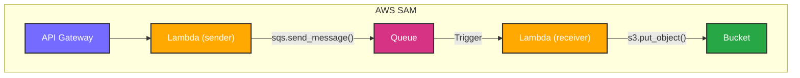

## Chapter 07 Amazon API Gateway で API をデプロイしよう



### サーバレスアプリケーションをデプロイする

```shell
$ sam build
$ sam deploy

CloudFormation outputs from deployed stack
--------------------------------------------------------
Outputs
--------------------------------------------------------
Key                 ApiId
Description         -
Value               hurjtrvfi3
--------------------------------------------------------

```

```shell
$ aws apigateway get-rest-apis
{
    "items": [
        {
            "id": "opwmtdqdrs",
            "name": "chapter07-stack-ServerlessRestApi-acf70a81",
            "createdDate": "2025-06-02T00:52:38+09:00",
            "version": "1.0",
            "apiKeySource": "HEADER",
            "endpointConfiguration": {
                "types": [
                    "EDGE"
                ]
            },
            "tags": {
                "aws:cloudformation:logical-id": "ServerlessRestApi",
                "aws:cloudformation:stack-name": "chapter07-stack",
                "aws:cloudformation:stack-id": "arn:aws:cloudformation:us-east-1:000000000000:stack/chapter07-stack/495b6484"
            },
            "disableExecuteApiEndpoint": false,
            "rootResourceId": "hurjtrvfi3"
        }
    ]
}
$ aws apigateway get-stages --rest-api-id opwmtdqdrs
{
    "item": [
        {
            "deploymentId": "l9l0hmbgwe",
            "stageName": "Stage",
            "cacheClusterEnabled": false,
            "cacheClusterStatus": "NOT_AVAILABLE",
            "methodSettings": {},
            "tracingEnabled": false
        },
        {
            "deploymentId": "l9l0hmbgwe",
            "stageName": "Prod",
            "cacheClusterEnabled": false,
            "cacheClusterStatus": "NOT_AVAILABLE",
            "methodSettings": {},
            "tracingEnabled": false
        }
    ]
}
$ aws apigateway get-resources --rest-api-id opwmtdqdrs
{
    "items": [
        {
            "id": "hurjtrvfi3",
            "path": "/",
            "resourceMethods": {
                "POST": {
            "resourceMethods": {
                "POST": {
                    "httpMethod": "POST",
                    "authorizationType": "NONE",
                    "apiKeyRequired": false,
                    "methodResponses": {},
                    "methodIntegration": {
                        "type": "AWS_PROXY",
                        "httpMethod": "POST",
                        "uri": "arn:aws:apigateway:us-east-1:lambda:path/2015-03-31/functions/arn:aws:lambda:us-east-1:000000000000:function:chapter07-sender-function/invocations",
                        "passthroughBehavior": "WHEN_NO_MATCH",
                        "timeoutInMillis": 29000,
                        "cacheNamespace": "hurjtrvfi3",
                        "cacheKeyParameters": []
                    }
                }
            }
        }
    ]
}
```

```shell
$ curl -X POST "http://localstack:4566/restapis/opwmtdqdrs/Prod/_user_request_/"
{
  "id": "id2140"
}
```

### その他確認

````shell
$ aws apigateway get-rest-apis
$ aws apigateway get-resources \
    --rest-api-id $(aws apigateway get-rest-apis --query 'items[?name==`chapter07-stack-ServerlessRestApi-acf70a81`].id' --output text)


```bash
# API Gateway IDを取得
API_ID=$(terraform output -raw api_gateway_id)

# APIをテスト
curl -X POST \
  -H "Content-Type: application/json" \
  -d '{"num1": "10", "num2": "10"}' \
  "http://localstack:4566/restapis/$API_ID/prod/_user_request_/calc"
curl -X POST \
  "http://localstack:4566/restapis/hurjtrvfi3/prod/_user_request_/"
````

```bash
# LocalStack環境でのAPIテスト
curl -X GET "http://localstack:4566/restapis/97kpcfv5ou/Prod/_user_request_/hello"
```
