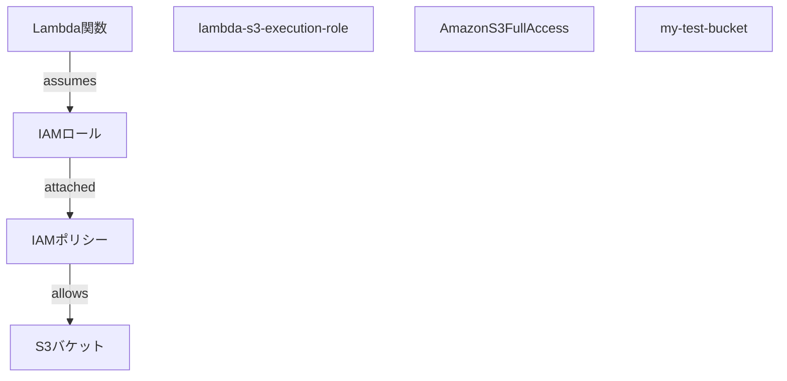

# IAM（Identity and Access Management）学習ガイド

AWS Lambda + S3 プロジェクトを通して学んだIAMの基本概念と実装例

## 🎯 **IAMとは？**

**Identity and Access Management（IAM）** は、AWSリソースへのアクセスを安全にコントロールするサービスです。

- **誰が** (Identity)
- **何に** (Resource) 
- **どんな操作を** (Action)
- **できるのか** (Permission)

を細かく制御します。

## 🔑 **基本概念**

### 1. IAMロール（Role）
- **役割や立場**を定義するもの
- 一時的に引き受けることができる権限セット
- ユーザーやサービス（Lambda等）が「なりすます」ことができる

### 2. IAMポリシー（Policy）
- **具体的な権限**を定義するもの
- JSON形式で「何ができるか」を記述
- ロールにアタッチして使用

### 3. IAMユーザー（User）
- **個人や個別のエンティティ**
- 長期的な認証情報を持つ

### 4. ARN（Amazon Resource Name）
- **AWSリソースの一意識別子**
- `arn:aws:service:region:account:resource`の形式

## 🚀 **Lambda + S3 での実装例**

### 📋 **プロジェクトでの権限設定フロー**



### 1. **IAMロール作成**

```bash
aws iam create-role \
  --role-name lambda-s3-execution-role \
  --assume-role-policy-document '{
    "Version": "2012-10-17",
    "Statement": [
      {
        "Effect": "Allow",
        "Principal": {"Service": "lambda.amazonaws.com"},
        "Action": "sts:AssumeRole"
      }
    ]
  }'
```

**意味**: 
- ロール名: `lambda-s3-execution-role`
- 信頼ポリシー: Lambda サービスがこのロールを引き受け可能
- `sts:AssumeRole`: ロールを引き受けるアクション

### 2. **IAMポリシーアタッチ**

```bash
aws iam attach-role-policy \
  --role-name lambda-s3-execution-role \
  --policy-arn arn:aws:iam::aws:policy/AmazonS3FullAccess
```

**意味**:
- 既存のAWS管理ポリシー `AmazonS3FullAccess` をロールにアタッチ
- S3への完全アクセス権限を付与

### 3. **Lambda関数にロール割り当て**

```bash
aws lambda create-function \
  --function-name s3-text-handler \
  --role arn:aws:iam::000000000000:role/lambda-s3-execution-role \
  # ... 他のパラメータ
```

**意味**:
- Lambda関数 `s3-text-handler` に IAMロールを割り当て
- この関数は実行時にロールの権限を使用

## 🔍 **権限の流れの詳細説明**

### ❓ **よくある誤解**

> "IAMロールはLambdaへのアクセスを許可する"

### ✅ **正しい理解**

> "IAMロールはLambda関数が他のAWSサービスにアクセスするための権限を提供する"

### 🎯 **実際の動作フロー**

```
1. Lambda関数実行開始
   ↓
2. Lambda関数が指定されたIAMロールを引き受け (AssumeRole)
   ↓  
3. そのロールにアタッチされたポリシーを確認
   ↓
4. ポリシーで許可された操作のみ実行可能
   ↓
5. S3への操作（PUT/GET/DELETE）を実行
```

## 📝 **信頼ポリシー vs 権限ポリシー**

### 信頼ポリシー（Trust Policy）
```json
{
  "Version": "2012-10-17",
  "Statement": [
    {
      "Effect": "Allow",
      "Principal": {"Service": "lambda.amazonaws.com"},
      "Action": "sts:AssumeRole"
    }
  ]
}
```
**役割**: **誰がこのロールを引き受けられるか**を定義

### 権限ポリシー（Permission Policy）
```json
{
  "Version": "2012-10-17",
  "Statement": [
    {
      "Effect": "Allow",
      "Action": [
        "s3:GetObject",
        "s3:PutObject", 
        "s3:DeleteObject",
        "s3:ListBucket"
      ],
      "Resource": [
        "arn:aws:s3:::my-test-bucket",
        "arn:aws:s3:::my-test-bucket/*"
      ]
    }
  ]
}
```
**役割**: **このロールで何ができるか**を定義

## 🛠️ **実践的な確認コマンド**

### 現在の設定確認

```bash
# 環境変数設定
export AWS_ENDPOINT_URL=http://localstack:4566

# 1. IAMロールの存在確認
aws iam get-role \
  --role-name lambda-s3-execution-role \
  --endpoint-url=$AWS_ENDPOINT_URL

# 2. アタッチされたポリシー一覧
aws iam list-attached-role-policies \
  --role-name lambda-s3-execution-role \
  --endpoint-url=$AWS_ENDPOINT_URL

# 3. Lambda関数のロール確認  
aws lambda get-function \
  --function-name s3-text-handler \
  --endpoint-url=$AWS_ENDPOINT_URL \
  --query 'Configuration.Role'

# 4. ロールの信頼ポリシー確認
aws iam get-role \
  --role-name lambda-s3-execution-role \
  --endpoint-url=$AWS_ENDPOINT_URL \
  --query 'Role.AssumeRolePolicyDocument'
```

### リソース一覧確認

```bash
# プロジェクトで作成されたIAMリソース確認
./scripts/list-resources.sh
```

## 🎓 **学習のポイント**

### 1. **最小権限の原則**
- 必要最小限の権限のみを付与
- 例：S3FullAccessではなく、特定のバケットのみ

### 2. **ロールベースアクセス制御**
- ユーザーに直接権限を付与せず、ロールを経由
- 一時的な認証情報で安全性向上

### 3. **権限の継承**
- Lambda関数 → IAMロール → IAMポリシー → 具体的権限

## 🔧 **カスタムポリシーの例**

より厳密な権限制御のためのカスタムポリシー：

```json
{
  "Version": "2012-10-17",
  "Statement": [
    {
      "Effect": "Allow", 
      "Action": [
        "s3:GetObject",
        "s3:PutObject",
        "s3:DeleteObject"
      ],
      "Resource": "arn:aws:s3:::my-test-bucket/uploads/*"
    },
    {
      "Effect": "Allow",
      "Action": "s3:ListBucket", 
      "Resource": "arn:aws:s3:::my-test-bucket",
      "Condition": {
        "StringLike": {
          "s3:prefix": "uploads/*"
        }
      }
    }
  ]
}
```

**特徴**:
- `uploads/` フォルダのみアクセス可能
- ルートレベルのオブジェクトにはアクセス不可

## 📚 **さらなる学習リソース**

### AWS公式ドキュメント
- [IAM ユーザーガイド](https://docs.aws.amazon.com/ja_jp/IAM/latest/UserGuide/)
- [Lambda実行ロール](https://docs.aws.amazon.com/ja_jp/lambda/latest/dg/lambda-intro-execution-role.html)

### ベストプラクティス
1. **定期的な権限レビュー**
2. **MFA（多要素認証）の使用**
3. **CloudTrailでのアクセス監査**
4. **ロールの命名規則統一**

## 🎉 **まとめ**

- **IAMロール**: Lambda関数が「なりすます」役割
- **IAMポリシー**: 具体的な権限の定義
- **信頼関係**: どのサービスがロールを使えるか
- **権限委任**: Lambda関数 → ロール → ポリシー → リソースアクセス

**セキュリティは段階的に制御し、必要最小限の権限で運用することが重要です！**

---

📅 **作成日**: 2025年11月3日  
📁 **プロジェクト**: Lambda TypeScript + S3 CRUD  
🎯 **目的**: IAMの基本概念習得と実装理解