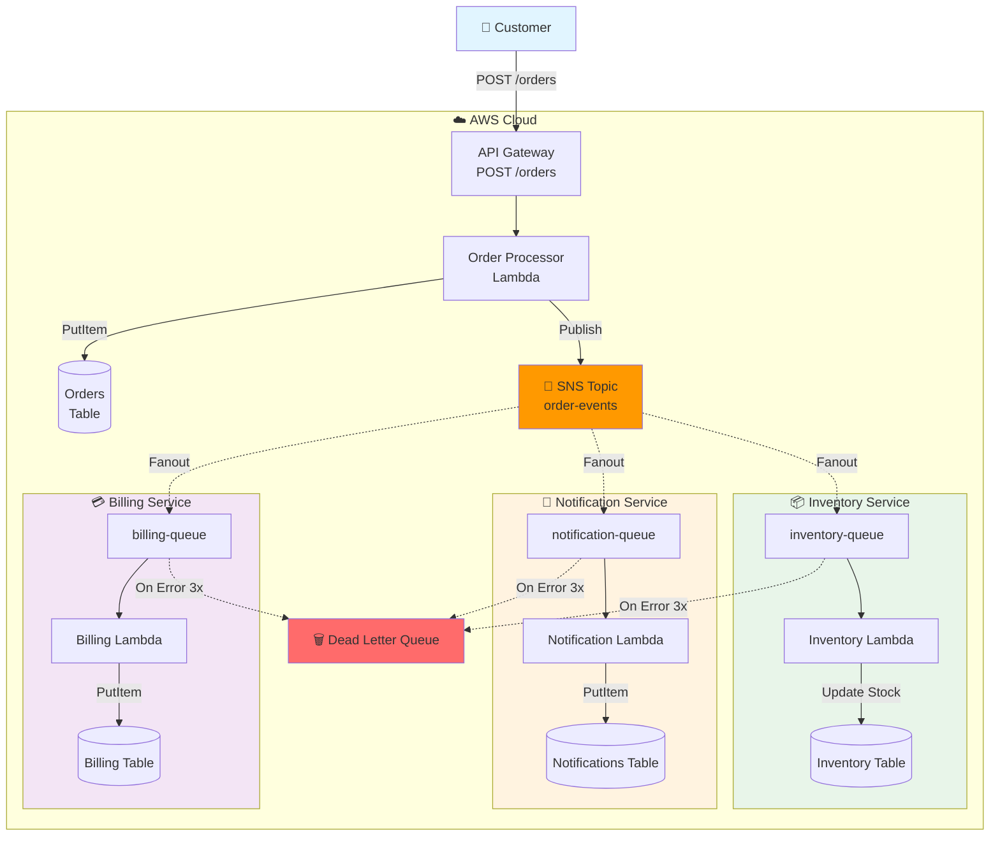

# 📦 E-コマース注文処理システム（マイクロサービスパターン）

**学習目的**: SNS ファンアウト、マイクロサービスアーキテクチャ、非同期処理

## 🎯 システム概要

顧客の注文を受け取り、複数の独立したマイクロサービスが並行処理を実行するシステム。

```
顧客の注文
    ↓
API Gateway (POST /orders)
    ↓
Order Processor Lambda
    ↓
SNS Topic (order-events) ← ファンアウトハブ
    ↓ (並行配信)
    ├─→ SQS → Inventory Service Lambda (在庫確認・引き当て)
    ├─→ SQS → Notification Service Lambda (顧客通知)
    └─→ SQS → Billing Service Lambda (請求処理)
```



## 🏗️ アーキテクチャコンポーネント

### DynamoDB テーブル

- **orders** - 注文情報（PK: orderId, SK: createdAt）
- **inventory** - 在庫情報（PK: productId）
- **notifications** - 通知履歴（PK: notificationId, SK: createdAt）
- **billing** - 請求情報（PK: billingId, SK: orderId）

### SNS/SQS

- **SNS Topic**: `order-events` - イベント配信ハブ
- **SQS Queues**:
  - `inventory-queue` - 在庫サービス用
  - `notification-queue` - 通知サービス用
  - `billing-queue` - 請求サービス用
  - `order-processing-dlq` - エラーメッセージ保管（DLQ）

### Lambda 関数（予定）

1. **Order Processor** - 注文受付・SNS 発行
2. **Inventory Service** - 在庫確認・引き当て
3. **Notification Service** - 顧客通知
4. **Billing Service** - 請求処理

## 📝 実装ステップ

### ✅ Phase 1: 基礎インフラ構築（完了）

**目的**: イベント駆動アーキテクチャの土台を作る

- DynamoDB テーブル 4 つを作成（各マイクロサービス用のデータストア）
- SNS Topic を作成（イベントのファンアウトハブとして機能）
- SQS キュー 3 つ + DLQ を作成（マイクロサービス間の疎結合通信）
- SNS → SQS のサブスクリプション設定（1 イベントを複数サービスに配信）
- 初期データ投入スクリプト作成（テスト用の商品在庫データ）

### ✅ Phase 2: Order Processor Lambda + API Gateway（完了）

**目的**: 注文受付のエントリポイントを作る

- API Gateway REST API を作成（POST /orders エンドポイント）
- Order Processor Lambda 関数を実装（TypeScript、NodejsFunction で自動ビルド）
- 注文データのバリデーション処理（必須フィールド、データ型チェック）
- orders テーブルへの保存処理（注文 ID 生成、タイムスタンプ付与）
- SNS への注文イベント発行（JSON ペイロードでファンアウト）

### ✅ Phase 3: マイクロサービス Lambda（3 つ）- 完了

**目的**: 独立した複数のサービスで並行処理を実現

#### ✅ 3-1. Inventory Service Lambda

- SQS（inventory-queue）をトリガーに設定（batchSize: 10）
- 商品 ID で在庫テーブルを検索し、在庫数をチェック
- 在庫がある場合は引き当て処理（stock - quantity で更新）
- 在庫不足の場合はエラースロー（3 回リトライ後 DLQ へ）
- 最終更新タイムスタンプと注文 ID を記録

#### ✅ 3-2. Notification Service Lambda

- SQS（notification-queue）をトリガーに設定（batchSize: 10）
- 顧客メールアドレスに注文確認メールを送信（実際は SES を使用予定）
- メール送信履歴を notifications テーブルに記録
- 送信成功ステータス（sent）を記録
- メール内容に注文詳細（注文番号、金額、商品一覧）を含む

#### ✅ 3-3. Billing Service Lambda

- SQS（billing-queue）をトリガーに設定（batchSize: 10）
- 注文情報から請求金額を計算（小計 + 消費税 10%）
- 商品明細の整形（各商品の小計を計算）
- 請求レコードを billing テーブルに作成
- 請求ステータス（pending）を管理

### ✅ Phase 4: エンドツーエンドテスト（完了）

**目的**: システム全体のエンドツーエンドテストを実施

- テストスクリプト作成（curl で API Gateway にリクエスト送信）
- 正常フローのテスト（在庫あり → 全サービス成功を確認）✅
- エラーフローのテスト（在庫切れ商品の注文で Inventory Service エラー）✅
- 並行処理のテスト（5 つの注文を同時送信 → 1 秒で完了）✅
- DLQ 管理機能（メッセージ確認・リトライ・削除）✅

## 🚀 デプロイ手順

### 前提条件

- LocalStack が起動していること
- cdklocal がインストール済み

### デプロイ

```bash
# 依存関係インストール
npm install

# TypeScriptコンパイル
npm run build

# LocalStackにデプロイ
cdklocal deploy --require-approval never
```

### 動作確認

```bash
# すべてのリソースを確認
bash scripts/check-resources.sh

# 初期データ（在庫情報）を投入
bash scripts/seed-data.sh
```

## 📚 学習ポイント

- ✅ **Pub/Sub パターン**: SNS で 1 イベント → 複数サービスに配信
- ✅ **ファンアウト**: 並行処理による高速化
- ✅ **サービス分離**: 各マイクロサービスの独立性
- ✅ **非同期処理**: SQS による疎結合アーキテクチャ
- ✅ **エラーハンドリング**: DLQ（Dead Letter Queue）による信頼性向上

## 🧪 テストシナリオ（✅ 完了）

### Phase 4 テスト結果

#### 1. **並行処理テスト** ✅

```bash
./scripts/test-parallel-processing.sh
```

- 5 つの注文を同時送信 → **1 秒で完了**
- SNS ファンアウト → 3 つのマイクロサービスが並行動作
- 在庫が正確に減少（競合制御成功）
- 全キュー処理完了（0 メッセージ）

#### 2. **エラーシナリオテスト** ✅

```bash
./scripts/test-error-scenarios.sh
```

- 在庫切れ商品の注文 → Inventory Service でエラー検出
- エラーメッセージ: `Insufficient stock for 人気商品（在庫切れ）. Available: 0, Requested: 1`
- Notification/Billing Service は正常動作（**サービス分離成功**）
- エラーログに詳細記録

#### 3. **システム全体確認** ✅

```bash
./scripts/test-summary.sh
```

- 注文作成: **100%成功**（10 件）
- 通知送信: **100%成功**（10 件）
- 請求処理: **100%成功**（10 件）
- 在庫更新: **60%成功**（6 件成功、4 件エラー - 意図的な在庫不足）

## 📊 テスト結果サマリー

### 処理統計

| サービス             | 成功  | エラー | 成功率 |
| -------------------- | ----- | ------ | ------ |
| Order Processor      | 10 件 | 0 件   | 100%   |
| Inventory Service    | 6 件  | 4 件   | 60%    |
| Notification Service | 10 件 | 0 件   | 100%   |
| Billing Service      | 10 件 | 0 件   | 100%   |

### 在庫変動

- ノート PC: 10 個 → **7 個**（3 件注文）
- ワイヤレスマウス: 50 個 → **45 個**（5 件注文）
- メカニカルキーボード: 25 個 → **24 個**（1 件注文）
- 人気商品（在庫切れ）: **0 個**（エラー発生）

## 🎯 テストスクリプト

### 基本テスト

```bash
# リソース確認
bash scripts/check-resources.sh

# Phase 3動作確認
bash scripts/verify-phase3.sh

# API経由で注文作成
bash scripts/test-order-api.sh
```

### 高度なテスト

```bash
# 並行処理テスト（5件同時）
bash scripts/test-parallel-processing.sh

# エラーシナリオテスト（在庫不足）
bash scripts/test-error-scenarios.sh

# DLQ管理（手動リトライ）
bash scripts/manage-dlq.sh

# 完全サマリー
bash scripts/test-summary.sh
```

## 📖 Useful commands

- `npm run build` - TypeScript コンパイル
- `npm run watch` - 変更監視＆自動コンパイル
- `npm run test` - Jest ユニットテスト
- `cdklocal deploy` - LocalStack にデプロイ
- `cdklocal destroy` - スタック削除
