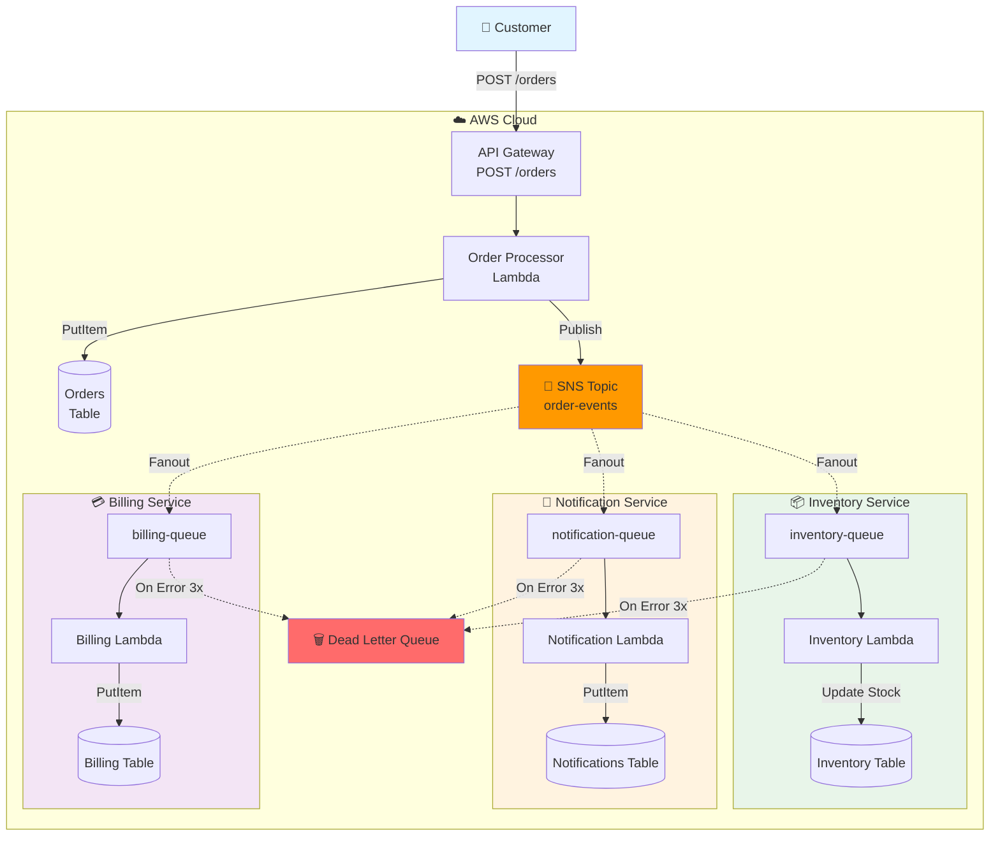

# 📦 E-コマース注文処理システム（マイクロサービスパターン + フロントエンド UI）

**学習目的**: SNS ファンアウト、マイクロサービスアーキテクチャ、非同期処理、Next.js UI 統合

## 🎯 システム概要

顧客の注文を受け取り、複数の独立したマイクロサービスが並行処理を実行するシステム。
フロントエンド UI から注文を作成し、各マイクロサービスの処理状況をリアルタイムで確認できます。

```
👤 ブラウザ (Next.js on S3)
    ↓
API Gateway (POST /orders, GET /orders, GET /inventory, etc.)
    ↓
Order Processor Lambda → SNS Topic (order-events) ← ファンアウトハブ
    ↓                            ↓ (並行配信)
Orders Table            ├─→ SQS → Inventory Service Lambda (在庫確認・引き当て)
                        ├─→ SQS → Notification Service Lambda (顧客通知)
                        └─→ SQS → Billing Service Lambda (請求処理)
```



## 🏗️ アーキテクチャコンポーネント

### DynamoDB テーブル

- **orders** - 注文情報（PK: orderId, SK: createdAt）
- **inventory** - 在庫情報（PK: productId）
- **notifications** - 通知履歴（PK: notificationId, SK: createdAt）
- **billing** - 請求情報（PK: billingId, SK: orderId）

### SNS/SQS

- **SNS Topic**: `order-events` - イベント配信ハブ
- **SQS Queues**:
  - `inventory-queue` - 在庫サービス用
  - `notification-queue` - 通知サービス用
  - `billing-queue` - 請求サービス用
  - `order-processing-dlq` - エラーメッセージ保管（DLQ）

### Lambda 関数（予定）

1. **Order Processor** - 注文受付・SNS 発行
2. **Inventory Service** - 在庫確認・引き当て
3. **Notification Service** - 顧客通知
4. **Billing Service** - 請求処理

## 📝 実装ステップ

### ✅ Phase 1: 基礎インフラ構築（完了）

**目的**: イベント駆動アーキテクチャの土台を作る

- DynamoDB テーブル 4 つを作成（各マイクロサービス用のデータストア）
- SNS Topic を作成（イベントのファンアウトハブとして機能）
- SQS キュー 3 つ + DLQ を作成（マイクロサービス間の疎結合通信）
- SNS → SQS のサブスクリプション設定（1 イベントを複数サービスに配信）
- 初期データ投入スクリプト作成（テスト用の商品在庫データ）

### ✅ Phase 2: Order Processor Lambda + API Gateway（完了）

**目的**: 注文受付のエントリポイントを作る

- API Gateway REST API を作成（POST /orders エンドポイント）
- Order Processor Lambda 関数を実装（TypeScript、NodejsFunction で自動ビルド）
- 注文データのバリデーション処理（必須フィールド、データ型チェック）
- orders テーブルへの保存処理（注文 ID 生成、タイムスタンプ付与）
- SNS への注文イベント発行（JSON ペイロードでファンアウト）

### ✅ Phase 3: マイクロサービス Lambda（3 つ）- 完了

**目的**: 独立した複数のサービスで並行処理を実現

#### ✅ 3-1. Inventory Service Lambda

- SQS（inventory-queue）をトリガーに設定（batchSize: 10）
- 商品 ID で在庫テーブルを検索し、在庫数をチェック
- 在庫がある場合は引き当て処理（stock - quantity で更新）
- 在庫不足の場合はエラースロー（3 回リトライ後 DLQ へ）
- 最終更新タイムスタンプと注文 ID を記録

#### ✅ 3-2. Notification Service Lambda

- SQS（notification-queue）をトリガーに設定（batchSize: 10）
- 顧客メールアドレスに注文確認メールを送信（実際は SES を使用予定）
- メール送信履歴を notifications テーブルに記録
- 送信成功ステータス（sent）を記録
- メール内容に注文詳細（注文番号、金額、商品一覧）を含む

#### ✅ 3-3. Billing Service Lambda

- SQS（billing-queue）をトリガーに設定（batchSize: 10）
- 注文情報から請求金額を計算（小計 + 消費税 10%）
- 商品明細の整形（各商品の小計を計算）
- 請求レコードを billing テーブルに作成
- 請求ステータス（pending）を管理

### ✅ Phase 4: エンドツーエンドテスト（完了）

**目的**: システム全体のエンドツーエンドテストを実施

- テストスクリプト作成（curl で API Gateway にリクエスト送信）
- 正常フローのテスト（在庫あり → 全サービス成功を確認）✅
- エラーフローのテスト（在庫切れ商品の注文で Inventory Service エラー）✅
- 並行処理のテスト（5 つの注文を同時送信 → 1 秒で完了）✅
- DLQ 管理機能（メッセージ確認・リトライ・削除）✅

---

## 🖥️ フロントエンド UI 実装（Phase 5-7）

### Phase 5: データ取得 Lambda + API エンドポイント追加

**目的**: フロントエンドからデータを取得するための GET API を実装

#### 実装する Lambda 関数（5 つ）

1. **Get Orders Lambda** - 注文一覧を取得

   - DynamoDB Scan で`orders`テーブルを取得
   - createdAt でソート（新しい順）
   - ページネーション対応（最大 100 件）

2. **Get Inventory Lambda** - 在庫一覧を取得

   - DynamoDB Scan で`inventory`テーブルを取得
   - 在庫数と商品情報を返す
   - 在庫切れ商品も含む（UI 側で判定）

3. **Get Notifications Lambda** - 通知履歴を取得

   - DynamoDB Scan で`notifications`テーブルを取得
   - createdAt でソート（新しい順）
   - 送信ステータス（sent/failed）を含む

4. **Get Billing Lambda** - 請求一覧を取得

   - DynamoDB Scan で`billing`テーブルを取得
   - 請求金額と請求ステータスを返す
   - orderId との紐付け情報を含む

5. **Get Dashboard Lambda** - ダッシュボード用統計情報
   - 各テーブルの件数を集計
   - 在庫切れ商品数をカウント
   - 最新 10 件の注文を取得
   - SQS キューのメッセージ数を取得（オプション）

#### API Gateway エンドポイント追加

```
既存: POST /orders          # 注文作成
追加: GET  /orders          # 注文一覧取得
追加: GET  /inventory       # 在庫一覧取得
追加: GET  /notifications   # 通知履歴取得
追加: GET  /billing         # 請求一覧取得
追加: GET  /dashboard       # ダッシュボード統計
```

#### CDK スタックへの追加

- S3 バケット（静的ホスティング用）
- 5 つの NodejsFunction（GET Lambda）
- API Gateway に GET メソッド追加
- 各 Lambda に DynamoDB テーブルの読み取り権限付与

---

### Phase 6: フロントエンド UI 実装

**目的**: Next.js でリッチな UI を実装し、リアルタイムで状態を可視化

#### 画面構成

##### 1. ダッシュボード（`/`）

**表示内容**:

- 4 つの統計カード
  - 📦 注文数（`orders`テーブルの件数）
  - 📋 在庫商品数（`inventory`テーブルの件数）
  - 📧 通知送信数（`notifications`テーブルの件数）
  - 💳 請求処理数（`billing`テーブルの件数）
- 最新 10 件の注文リスト（注文 ID、顧客名、金額、ステータス）
- 在庫切れ警告（在庫 0 の商品を赤字で表示）

**リアルタイム更新**:

- SWR で 5 秒ごとに自動リフレッシュ
- 注文作成後、各カウンターが順次更新される様子を可視化

##### 2. 注文作成フォーム（`/orders/new`）

**フォーム項目**:

- 顧客情報
  - 顧客名（必須、テキスト入力）
  - メールアドレス（必須、メール検証）
  - 配送先住所（必須、テキストエリア）
- 商品選択（複数商品対応）
  - 商品選択ドロップダウン（在庫テーブルから動的取得）
  - 在庫数表示（リアルタイム）
  - 数量入力（数値、在庫数を超えないバリデーション）
  - 商品追加/削除ボタン
- 合計金額表示（自動計算、消費税 10%込み）

**動作**:

- 送信 → API Gateway POST /orders
- 成功 → トースト通知 + ダッシュボードへリダイレクト
- エラー → エラーメッセージ表示（在庫不足など）

##### 3. 注文一覧（`/orders`）

**表示内容**:

- 注文テーブル（ソート・フィルタリング対応）
  - 注文 ID
  - 顧客名
  - メールアドレス
  - 注文日時
  - 商品一覧（折りたたみ表示）
  - 合計金額
  - ステータス（processing/completed/failed）
- ページネーション（50 件ごと）
- 検索機能（顧客名、メールで検索）

##### 4. 在庫状況（`/inventory`）

**表示内容**:

- 在庫テーブル
  - 商品 ID
  - 商品名
  - 価格
  - 在庫数（0 の場合は赤字で「在庫切れ」）
  - 最終更新日時
- 在庫切れフィルター（在庫 0 のみ表示）
- 在庫少フィルター（在庫 10 以下）

**リアルタイム更新**:

- 注文作成後、在庫数が自動で減少する様子を表示

##### 5. 通知履歴（`/notifications`）

**表示内容**:

- 通知テーブル
  - 通知 ID
  - 注文 ID（リンク → 注文詳細）
  - 顧客メールアドレス
  - 送信日時
  - ステータス（sent/failed）
  - メッセージ内容（プレビュー）
- ステータスフィルター

##### 6. 請求一覧（`/billing`）

**表示内容**:

- 請求テーブル
  - 請求 ID
  - 注文 ID（リンク → 注文詳細）
  - 請求金額
  - 小計/消費税の内訳
  - 商品明細
  - 請求日時
  - 請求ステータス（pending/completed/failed）
- ステータスフィルター
- 金額範囲フィルター

#### コンポーネント設計

```
frontend-nextjs/src/
├── app/
│   ├── page.tsx                    # ダッシュボード
│   ├── layout.tsx                  # 共通レイアウト + ナビゲーション
│   ├── orders/
│   │   ├── page.tsx               # 注文一覧
│   │   └── new/page.tsx           # 注文作成フォーム
│   ├── inventory/page.tsx          # 在庫一覧
│   ├── notifications/page.tsx      # 通知履歴
│   └── billing/page.tsx           # 請求一覧
├── components/
│   ├── DashboardCard.tsx          # 統計カード（4つのメトリクス表示）
│   ├── OrderForm.tsx              # 注文フォーム（複数商品対応）
│   ├── OrderList.tsx              # 注文テーブル（ソート・検索対応）
│   ├── InventoryTable.tsx         # 在庫テーブル（在庫切れハイライト）
│   ├── NotificationList.tsx       # 通知リスト（ステータスバッジ）
│   ├── BillingTable.tsx           # 請求テーブル（金額フォーマット）
│   ├── ProductSelector.tsx        # 商品選択コンポーネント（動的ドロップダウン）
│   └── StatusBadge.tsx            # ステータス表示バッジ（色分け）
├── lib/
│   ├── api/
│   │   ├── ordersApi.ts           # 注文APIクライアント（POST/GET）
│   │   ├── inventoryApi.ts        # 在庫APIクライアント（GET）
│   │   ├── notificationsApi.ts    # 通知APIクライアント（GET）
│   │   ├── billingApi.ts          # 請求APIクライアント（GET）
│   │   └── dashboardApi.ts        # ダッシュボードAPIクライアント（GET）
│   └── hooks/
│       ├── useOrders.ts           # SWRフック（注文一覧取得）
│       ├── useInventory.ts        # SWRフック（在庫取得）
│       ├── useNotifications.ts    # SWRフック（通知取得）
│       ├── useBilling.ts          # SWRフック（請求取得）
│       └── useDashboard.ts        # SWRフック（ダッシュボード統計）
└── types/
    └── api.ts                     # 型定義（Order, Inventory, Notification, Billing）
```

#### 技術スタック

- **Next.js 16** (App Router) - 静的エクスポートで S3 ホスティング
- **TypeScript** - 型安全性
- **Tailwind CSS 4** - スタイリング
- **SWR 2.x** - リアルタイムデータ取得＋キャッシング
- **React Hook Form** - フォーム管理（注文フォーム）
- **Zod** - バリデーションスキーマ

#### リアルタイム更新の実装

```typescript
// SWRで5秒ごとに自動リフレッシュ
const { data, error, isLoading, mutate } = useSWR('/api/orders', fetcher, {
  refreshInterval: 5000, // 5秒ごとに再取得
  revalidateOnFocus: true, // タブフォーカス時に再取得
});
```

---

### Phase 7: デプロイと E2E テスト

**目的**: フロントエンドを S3 にデプロイし、統合テストを実施

#### デプロイ手順

1. **フロントエンドビルド**

   ```bash
   cd frontend-nextjs
   npm run build  # Next.jsの静的エクスポート（out/ディレクトリ生成）
   ```

2. **S3 へデプロイ**（LocalStack 用スクリプト）

   ```bash
   bash scripts/deploy-frontend.sh
   ```

   スクリプト内容:

   ```bash
   #!/bin/bash
   awslocal s3 rm s3://ecommerce-frontend --recursive
   awslocal s3 sync frontend-nextjs/out/ s3://ecommerce-frontend/
   echo "Deployed to: http://ecommerce-frontend.s3.localhost.localstack.cloud:4566/index.html"
   ```

3. **動作確認**
   - ブラウザで S3 URL にアクセス
   - ダッシュボードが表示されることを確認
   - 注文作成フォームから注文を送信
   - 各テーブルビューでデータ更新を確認

#### E2E テスト（Playwright）

**テストシナリオ**:

1. **ダッシュボード表示テスト**

   - 4 つの統計カードが表示される
   - 最新注文リストが表示される

2. **注文作成フローテスト**

   - 注文フォームに遷移
   - 商品を選択（ドロップダウン）
   - 顧客情報を入力
   - 数量を指定
   - 送信ボタンをクリック
   - 成功トーストが表示される
   - ダッシュボードにリダイレクト

3. **リアルタイム更新テスト**

   - 注文作成後、5 秒待機
   - 注文数が+1 されることを確認
   - 在庫ページで在庫数が減少することを確認

4. **在庫切れエラーテスト**

   - 在庫 0 の商品を選択
   - エラーメッセージが表示される
   - 注文が作成されない

5. **各テーブルビューテスト**

   - 注文一覧ページ: 注文が表示される
   - 在庫ページ: 在庫が表示される
   - 通知ページ: 通知が表示される
   - 請求ページ: 請求が表示される

6. **データ整合性テスト**
   - 1 つの注文作成後
   - `orders`: 1 件追加
   - `inventory`: 在庫数減少
   - `notifications`: 1 件追加
   - `billing`: 1 件追加

#### テストスクリプト

```bash
# Playwrightテスト実行
cd frontend-nextjs
npm run test:e2e

# ヘッドレスモードで実行
npm run test:e2e:headless

# 特定のテストのみ実行
npx playwright test orders.spec.ts
```

#### LocalStack 特有の注意点

1. **BucketDeployment は動かない**

   - CDK の`BucketDeployment`コンストラクトは使用不可
   - 手動スクリプト（`awslocal s3 sync`）で代替

2. **タイムアウト設定**

   - LocalStack はレスポンスが遅い（本番の 3-5 倍）
   - Playwright のタイムアウトを 60 秒に設定

3. **CORS 設定**

   - API Gateway の CORS 設定を確認
   - `allowOrigins: ['*']`で LocalStack ドメインを許可

4. **エンドポイント URL**
   - `.env.local`で LocalStack の URL を指定
   ```bash
   NEXT_PUBLIC_API_URL=https://xxxxx.execute-api.localhost.localstack.cloud:4566/prod/
   ```

## 🚀 デプロイ手順

### 前提条件

- LocalStack が起動していること
- cdklocal がインストール済み

### デプロイ

```bash
# 依存関係インストール
npm install

# TypeScriptコンパイル
npm run build

# LocalStackにデプロイ
cdklocal deploy --require-approval never
```

### 動作確認

```bash
# すべてのリソースを確認
bash scripts/check-resources.sh

# 初期データ（在庫情報）を投入
bash scripts/seed-data.sh
```

## 📚 学習ポイント

### バックエンド（Phase 1-4）

- ✅ **Pub/Sub パターン**: SNS で 1 イベント → 複数サービスに配信
- ✅ **ファンアウト**: 並行処理による高速化
- ✅ **サービス分離**: 各マイクロサービスの独立性
- ✅ **非同期処理**: SQS による疎結合アーキテクチャ
- ✅ **エラーハンドリング**: DLQ（Dead Letter Queue）による信頼性向上

### フロントエンド（Phase 5-7）

- 📊 **リアルタイム UI**: SWR による自動リフレッシュとキャッシング
- 🎨 **複雑なフォーム**: React Hook Form + Zod バリデーション
- 🔄 **非同期処理の可視化**: 注文作成後の各サービスの処理状況をリアルタイム表示
- 📱 **レスポンシブデザイン**: Tailwind CSS によるモバイル対応
- 🧪 **E2E テスト**: Playwright による統合テスト
- 🎯 **型安全性**: TypeScript によるエンドツーエンドの型定義
- 🚀 **静的ホスティング**: Next.js の静的エクスポートを S3 にデプロイ

### アーキテクチャパターン

- **Event-Driven Architecture**: イベント駆動による疎結合設計
- **CQRS（Command Query Responsibility Segregation）**: 書き込み（POST）と読み取り（GET）の分離
- **Microservices**: 独立したサービスの並行処理
- **Static Site + API**: JAMstack パターン（S3 静的ホスティング + API Gateway）

## 🧪 テストシナリオ（✅ 完了）

### Phase 4 テスト結果

#### 1. **並行処理テスト** ✅

```bash
./scripts/test-parallel-processing.sh
```

- 5 つの注文を同時送信 → **1 秒で完了**
- SNS ファンアウト → 3 つのマイクロサービスが並行動作
- 在庫が正確に減少（競合制御成功）
- 全キュー処理完了（0 メッセージ）

#### 2. **エラーシナリオテスト** ✅

```bash
./scripts/test-error-scenarios.sh
```

- 在庫切れ商品の注文 → Inventory Service でエラー検出
- エラーメッセージ: `Insufficient stock for 人気商品（在庫切れ）. Available: 0, Requested: 1`
- Notification/Billing Service は正常動作（**サービス分離成功**）
- エラーログに詳細記録

#### 3. **システム全体確認** ✅

```bash
./scripts/test-summary.sh
```

- 注文作成: **100%成功**（10 件）
- 通知送信: **100%成功**（10 件）
- 請求処理: **100%成功**（10 件）
- 在庫更新: **60%成功**（6 件成功、4 件エラー - 意図的な在庫不足）

## 📊 テスト結果サマリー

### 処理統計

| サービス             | 成功  | エラー | 成功率 |
| -------------------- | ----- | ------ | ------ |
| Order Processor      | 10 件 | 0 件   | 100%   |
| Inventory Service    | 6 件  | 4 件   | 60%    |
| Notification Service | 10 件 | 0 件   | 100%   |
| Billing Service      | 10 件 | 0 件   | 100%   |

### 在庫変動

- ノート PC: 10 個 → **7 個**（3 件注文）
- ワイヤレスマウス: 50 個 → **45 個**（5 件注文）
- メカニカルキーボード: 25 個 → **24 個**（1 件注文）
- 人気商品（在庫切れ）: **0 個**（エラー発生）

## 🎯 テストスクリプト

### 基本テスト

```bash
# リソース確認
bash scripts/check-resources.sh

# Phase 3動作確認
bash scripts/verify-phase3.sh

# API経由で注文作成
bash scripts/test-order-api.sh
```

### 高度なテスト

```bash
# 並行処理テスト（5件同時）
bash scripts/test-parallel-processing.sh

# エラーシナリオテスト（在庫不足）
bash scripts/test-error-scenarios.sh

# DLQ管理（手動リトライ）
bash scripts/manage-dlq.sh

# 完全サマリー
bash scripts/test-summary.sh
```

## 📖 Useful commands

### バックエンド（CDK）

- `npm run build` - TypeScript コンパイル
- `npm run watch` - 変更監視＆自動コンパイル
- `npm run test` - Jest ユニットテスト
- `cdklocal deploy` - LocalStack にデプロイ
- `cdklocal destroy` - スタック削除

### フロントエンド（Next.js）

```bash
cd frontend-nextjs

# 開発サーバー起動
npm run dev

# 本番ビルド（静的エクスポート）
npm run build

# Playwrightテスト
npm run test:e2e
npm run test:e2e:headless
```

### デプロイ

```bash
# フロントエンドをS3にデプロイ
bash scripts/deploy-frontend.sh

# 全体を一括デプロイ
bash scripts/build-and-deploy.sh
```

---

## 🎯 実装の優先順位

### 推奨実装順序

1. **Phase 5: データ取得 API** → バックエンド拡張（GET Lambda 追加）
2. **Phase 6-1: ダッシュボード** → フロントエンド基礎（統計表示）
3. **Phase 6-2: 注文フォーム** → 最重要機能（注文作成 UI）
4. **Phase 6-3: 各テーブルビュー** → データ閲覧機能（4 画面）
5. **Phase 7: E2E テスト** → 品質保証（Playwright）

### 各 Phase 完了の定義

#### Phase 5 完了の条件

- ✅ 5 つの GET Lambda 関数がデプロイされている
- ✅ API Gateway に 5 つの GET エンドポイントが追加されている
- ✅ S3 バケットが作成されている
- ✅ curl で全エンドポイントが動作確認できる

#### Phase 6 完了の条件

- ✅ ダッシュボードが表示される
- ✅ 注文フォームから注文が作成できる
- ✅ 4 つのテーブルビューが表示される
- ✅ リアルタイム更新が動作する
- ✅ エラーハンドリングが適切に動作する

#### Phase 7 完了の条件

- ✅ フロントエンドが S3 にデプロイされている
- ✅ Playwright テストが全て通る
- ✅ 注文作成 → 各テーブル更新の統合テストが成功する

---

## 🚧 既知の制約・注意事項

### LocalStack 制約

1. **BucketDeployment 不可** - 手動スクリプトで代替
2. **レスポンス遅延** - 本番 AWS の 3-5 倍遅い
3. **並列実行制約** - Playwright の workers: 1 に制限

### DynamoDB 制約

1. **Scan 最大 1MB** - 大量データはページネーション必須
2. **検索機能制限** - 全文検索は不可（クライアント側でフィルタリング）

### 技術的制約

1. **認証なし** - 現状は誰でもアクセス可能（学習用）
2. **WebSocket なし** - ポーリングベース（5 秒ごと）
3. **画像アップロード不可** - 商品画像は URL 文字列のみ

---

## 🎓 発展課題（オプション）

完了後、さらに学習を深めたい場合の課題:

1. **認証追加** - Cognito User Pools で認証機能を追加
2. **WebSocket** - API Gateway WebSocket でリアルタイム通知
3. **画像アップロード** - 商品画像を S3 にアップロード
4. **検索機能強化** - ElasticSearch または DynamoDB GSI 追加
5. **マルチリージョン** - 複数リージョンへのデプロイ
6. **CI/CD** - GitHub Actions で自動デプロイ
7. **モニタリング** - CloudWatch Dashboard で可視化
8. **パフォーマンス改善** - DynamoDB Streams で SQS レスポンス高速化
